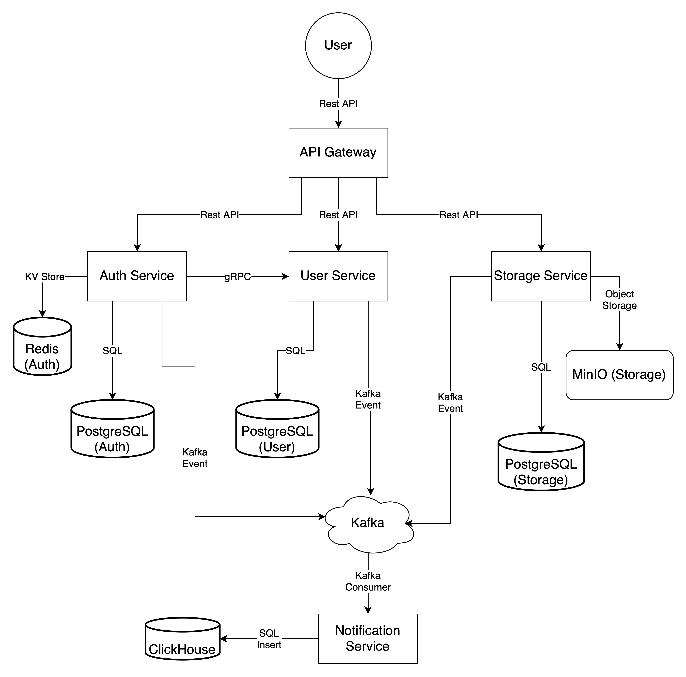

# 📦 Cloud Storage Platform

## Описание проекта
Платформа для хранения файлов на микросервисной архитектуре с поддержкой аутентификации пользователей, 
асинхронных уведомлений через Kafka и логированием событий в ClickHouse. 
Архитектура спроектирована с учетом масштабируемости и продакшн-подходов.

---

## ⚡ Стек технологий

| Категория         | Технология                        |
|-------------------|-----------------------------------|
| Backend           | Go, Python                        |
| Базы данных       | PostgreSQL, Redis, ClickHouse     |
| Хранилище файлов  | MinIO                             |
| Брокер сообщений  | Kafka                             |
| API               | REST, gRPC                        |
| Мониторинг        | Prometheus, Grafana (планируется) |
| Инфраструктура    | Docker, docker-compose            |

---

## 🏗 Архитектура проекта


- **Auth Service**: регистрация, логин, JWT токены, сессии.
- **User Service**: профили пользователей.
- **Storage Service**: загрузка/выдача файлов с ACL.
- **Notification Service**: сбор событий через Kafka, запись в ClickHouse.
- **API Gateway**: проверка токенов, проксирование запросов.

📚Подробнее об архитектуре см. [ARCHITECTURE.md](docs/ARCHITECTURE.md).

---

## 🚀 Как запустить проект
```bash
# 1. Клонируйте репозиторий
git clone https://github.com/yourusername/cloud-storage-platform.git
cd cloud-storage-platform

# 2. Запустите инфраструктуру через Docker Compose
docker-compose up --build
```

### Откроются следующие сервисы:

- Auth Service: [http://localhost:8000](http://localhost:8000)
- User Service: [http://localhost:8001](http://localhost:8001)
- Storage Service: [http://localhost:8002](http://localhost:8002)
- API Gateway: [http://localhost:8080](http://localhost:8080)

---

## 📚 Структура репозитория
```bash
cloud-storage-platform/
├── api-gateway/
├── auth-service/
├── user-service/
├── storage-service/
├── notification-service/
├── docker-compose.yml
├── README.md
└── docs/
└── architecture-diagram.png
```
---

### 🛤 Планы по развитию (Roadmap)

- [x] Микросервисы на Go и Python
- [x] Брокер Kafka для событий
- [ ] gRPC коммуникация между Auth и User
- [ ] OpenAPI документация
- [ ] Интеграция Prometheus и Grafana
- [ ] Kubernetes деплой
- [ ] Полное E2E тестирование
---

## 📄 Документация
Описание сервисов
Примеры API запросов
---

## 🤝 Контрибьютинг
В будущем возможен контрибьютинг через Pull Requests. Требования к коду:

- Чистота кода
- Документация изменений
- Покрытие тестами (по возможности)
---